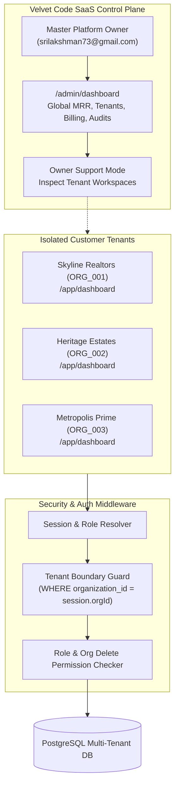

# Velvet Code — Real Estate CRM SaaS Platform

[](https://nextjs.org/)
[](https://www.typescriptlang.org/)
[](https://www.prisma.io/)
[](https://www.postgresql.org/)
[](https://tailwindcss.com/)
[](tests/security-runner.js)

> **Velvet Code** (*Technology & Digital Solutions*) presents a production-grade, multi-tenant Real Estate CRM SaaS engineered for real estate agents, brokers, large builder developments, and property consultants across India.

---

## 🌟 Product Overview

Velvet Code Real Estate CRM provides real estate professionals with an end-to-end operational platform—from AI lead scoring and WhatsApp Cloud API conversational marketing, to 6-stage Kanban deal pipelines, automated site visit tracking, and multi-tier SaaS billing.

### Key Highlights
* **Official Visual Identity**: Gold metallic branding, sleek dark-mode aesthetics, and zero distortion of the Velvet Code visual identity.
* **Strict Multi-Tenant Isolation**: Enforced at the server layer through database indexes and session-derived `organization_id` filters.
* **Master SaaS Owner Control**: Comprehensive administrative visibility for platform management, cross-tenant telemetry, customer support impersonation, and destructive action controls.
* **Indian Real Estate Native**: Pre-configured with INR currency formats (Lakhs / Crores), RERA ID badges, DTCP approval tracking, and local city catalogs (Chennai, Bangalore, Hyderabad, Mumbai, Coimbatore).

---

## 🛡️ Architecture & Multi-Tenancy



### Multi-Tenant Isolation Rules
1. **Server-Derived Tenant IDs**: Backend route handlers extract `organization_id` strictly from authenticated HTTP cookies/session headers. User-submitted `organization_id` in request payloads is ignored for non-owner accounts.
2. **Cross-Tenant Protection**: Direct API queries (e.g. `GET /api/properties/[id]`) for records belonging to another tenant immediately return `403 Forbidden` (`TENANT_MISMATCH`).
3. **Role-Based Deletion**:
   * **Master OWNER**: Platform-wide delete permissions with explicit UI confirmation modals.
   * **Customer ADMIN / MANAGER**: Deletion permitted only for records within their own `organization_id`.
   * **Customer AGENT**: Destructive actions blocked by default.

---

## 🔑 Authentication Matrix

| Account Type | Default Email / Role | Target Route | Scope & Permissions |
| :--- | :--- | :--- | :--- |
| **SaaS Master Owner** | `srilakshman73@gmail.com`<br/>`OWNER` | **`/admin/dashboard`** | Global SaaS metrics, tenant directory, billing, telemetry, user management, support impersonation, and destructive deletion powers. |
| **Customer Admin** | e.g. `ananya@velvetrealty.in`<br/>`ADMIN` | **`/app/dashboard`** | Full access within their own agency: team management, billing upgrades, properties, leads, deals, WhatsApp, and AI. |
| **Customer Manager** | e.g. `karthik@velvetrealty.in`<br/>`MANAGER` | **`/app/dashboard`** | Lead assignment, pipeline stage transitions, site visit confirmations, and team reporting within their agency. |
| **Customer Agent** | e.g. `divya@velvetrealty.in`<br/>`AGENT` | **`/app/dashboard`** | Assigned leads, property catalog, site visit check-ins, and WhatsApp client conversations within their agency. |

---

## ⚡ Core Feature Modules

### 1. WhatsApp Cloud CRM (`/app/whatsapp`)
* Direct Meta WhatsApp Cloud API integration.
* 3-column inbox with real-time conversations, rich media previews, and property brochure dispatch.
* Visual Trigger-Condition-Action automation builder (e.g. Instant brochure dispatch on website inquiry).
* Click-to-Chat direct routing to `+91 94436 47190`.

### 2. Realty AI Engine (`/app/ai`)
* Predictive Lead Scoring (0–100 probability index based on engagement, budget, and timeline).
* AI Property Recommendation Matchmaker.
* Automated WhatsApp response generator with human approval guardrails.

### 3. Sales Pipeline & Kanban (`/app/deals`)
* 6-Stage visual pipeline: *New Lead &rarr; Qualified &rarr; Site Visit &rarr; Negotiation &rarr; Documentation &rarr; Closed Won*.
* Confetti deal closure celebration and commission tally.

### 4. Property Inventory Engine (`/app/properties`)
* Residential & Commercial catalog (Villas, Apartments, DTCP Plots, Penthouses).
* Area calculations, carpet area specifications, RERA registration numbers, and photo galleries.

### 5. SaaS Master Headquarters (`/admin`)
* Real-time MRR, ARR, and ARPU telemetry.
* Tenant lifecycle manager (Active, Past Due, Suspended).
* 18% GST tax ledger and Razorpay invoice generator.
* Compute monitoring: AI token consumption and WhatsApp message volume.

---

## ⚙️ Environment Variables

Copy `.env.example` to `.env.local` for local development:

```bash
cp .env.example .env.local
```

### Configuration Keys

| Variable | Description |
| :--- | :--- |
| `OWNER_EMAIL` | Master SaaS Owner login email (`srilakshman73@gmail.com`). |
| `OWNER_PASSWORD` | Master SaaS Owner secure password for testing (`Velvetcode@123`). |
| `DATABASE_URL` | PostgreSQL connection string with pooled connection support. |
| `AUTH_SECRET` | 32-character secret key for JWT session encryption. |
| `NEXT_PUBLIC_APP_URL` | Base application URL (`http://localhost:3000` or production domain). |
| `NEXT_PUBLIC_RAZORPAY_KEY_ID` | Razorpay public key for frontend checkout. |
| `RAZORPAY_KEY_SECRET` | Razorpay private key for backend signature verification. |
| `WHATSAPP_API_TOKEN` | Meta Graph API access token for WhatsApp Cloud API. |
| `GEMINI_API_KEY` | Google Gemini AI API key for Realty AI processing. |

---

## 🚀 Local Development

### 1. Prerequisites
* Node.js 18.18+ or Node.js 20+
* npm, yarn, or pnpm
* PostgreSQL database (optional for mock runtime)

### 2. Install Dependencies
```bash
npm install
```

### 3. Run Development Server
```bash
npm run dev
```
Open [http://localhost:3000](http://localhost:3000) to view the application.

### 4. Run Security Test Suite
```bash
node tests/security-runner.js
```
Runs the 12-point automated multi-tenant security verification suite.

---

## 🗄️ Database Setup & Migrations

The database is defined in [`prisma/schema.prisma`](prisma/schema.prisma) with full multi-tenant relations and cascade rules.

```bash
# Generate Prisma Client
npx prisma generate

# Apply Migrations to PostgreSQL
npx prisma migrate dev --name init_multi_tenant

# Open Prisma Studio
npx prisma studio
```

---

## 🚢 Production Build & Vercel Deployment

### 1. Validate Production Build
```bash
npm run build
```

### 2. Deploy with Vercel CLI
```bash
# Install Vercel CLI
npm install -g vercel

# Deploy to Vercel Production
vercel --prod
```

### 3. Vercel Environment Configuration
In the Vercel Project Dashboard (`Settings -> Environment Variables`), configure:
* `OWNER_EMAIL` = `srilakshman73@gmail.com`
* `OWNER_PASSWORD` = `Velvetcode@123`
* `AUTH_SECRET` = `<your-32-char-secret>`
* `DATABASE_URL` = `<your-postgresql-connection-string>`
* `NEXT_PUBLIC_APP_URL` = `https://<your-vercel-domain>.vercel.app`

---

## 🔒 Security Architecture Highlights

1. **Zero Secret Leakage**: No API keys, database URLs, or passwords committed to Git.
2. **Server-Side Authorization**: All mutations verify role and organization ownership on the server before database execution.
3. **Destructive Guardrails**: Permanent deletions of users, properties, or organizations require explicit confirmation modals.
4. **Data Privacy**: DPDP Act and Indian IT Act compliant privacy architecture.

---

## 📄 License & Brand Ownership

Copyright &copy; 2026 **Velvet Code** (*Technology & Digital Solutions*). All rights reserved.
Official WhatsApp: `+91 94436 47190` &bull; Email: `srilakshman73@gmail.com`
